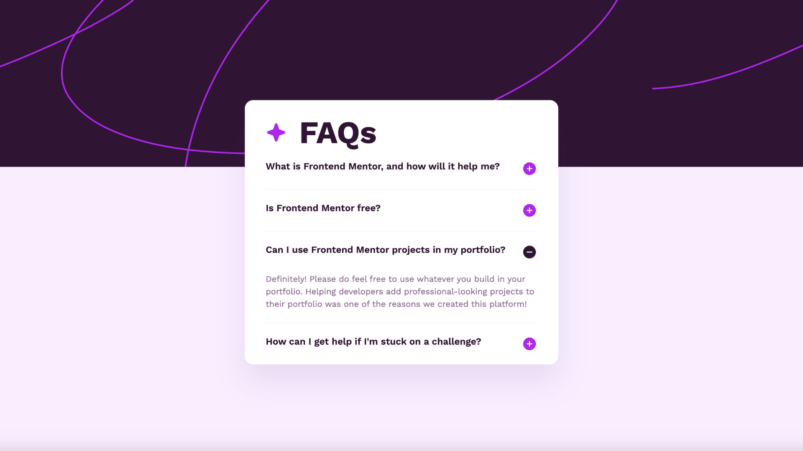

# Frontend Mentor - FAQ accordion solution

This is a solution to the [FAQ accordion challenge on Frontend Mentor](https://www.frontendmentor.io/challenges/faq-accordion-wyfFdeBwBz).

I completed this challenge using best practices for accessibility, so that assisted technology users can navigate the list items appropriately with accurate alt tags and aria labels.

### The challenge

Users should be able to:

- Hide/Show the answer to a question when the question is clicked
- Navigate the questions and hide/show answers using keyboard navigation alone
- View the optimal layout for the interface depending on their device's screen size
- See hover and focus states for all interactive elements on the page

### Screenshot

### Links

- Live Site URL: [https://faq.adamrichardturner.dev](https://faq.adamrichardturner.dev)

## My process

### Built with

- [React](https://reactjs.org/) - JS library
- [Next.js](https://nextjs.org/) - React framework
- [Tailwind CSS](https://tailwindcss.com) - CSS Framework
